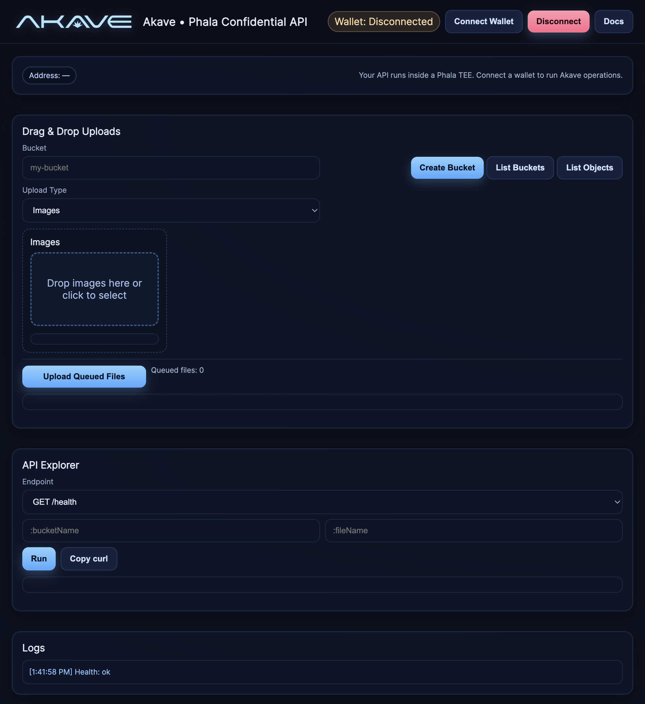

# Akavelink - Decentralized Storage API Template for Phala Cloud

[](https://cloud.phala.network/templates/akave-link)

A live example of this template is running here: [https://842d756c5daccbc4041437eb6be544c419760b31-80.dstack-prod5.phala.network/](https://842d756c5daccbc4041437eb6be544c419760b31-80.dstack-prod5.phala.network/)



A secure, confidential REST API wrapper for [Akave](https://akave.ai) decentralized storage, engineered to run within Phala Cloud's Trusted Execution Environment (TEE). This comprehensive template delivers everything you need to seamlessly integrate decentralized storage into your applications while maintaining the highest security standards through an intuitive, interactive interface.

## 🎯 Template Features

- ✅ **TEE-secured deployment** with confidential computing guarantees
- ✅ **Interactive API explorer** with real-time upload progress tracking
- ✅ **Hardware-encrypted key management** via Trusted Execution Environment
- ✅ **Containerized runtime** with pre-compiled akavecli binary
- ✅ **RESTful storage interface** supporting full CRUD operations
- ✅ **Cross-origin resource sharing** for seamless frontend integration
- ✅ **Comprehensive health checks** and monitoring endpoints
- ✅ **Enterprise-grade reliability** with structured logging and error handling

## 🚀 Deploy to Phala Cloud

### Prerequisites
1. **Akave Account**: Use any EVM private key securely with our TEE.

2. **Fund Your Wallet**: Use the [Akave Faucet](https://faucet.akave.ai) to get test tokens
3. **Phala Account**: Sign up at [cloud.phala.network](https://cloud.phala.network)

### Quick Deploy (Recommended)

1. **Click the Deploy button** 

2. **Configure your deployment:**
   - Enter your private key when prompted
      
   - Select your compute resources (2 vCPU, 2GB RAM recommended)
   - Choose your deployment region (prod8 is recommended)

3. **Deploy and access your API:**
   - **Deployment URL**: Your API will be available at `https://<your-app-id>-80.dstack-prod8.phala.network/`
   - **Example**: `https://415ddd60aadec178dd13045077c631a69bf6c4a0-80.dstack-prod8.phala.network/`
   - **Interactive Interface**: Access the full-featured UI at your root URL with:
     - 📤 Real-time upload progress tracking
     - 📂 One-click file browsing with "List Objects" button
     - 🔗 Direct download links in the API explorer
     - 📋 Complete API reference documentation
   
   **🔒 Security Verification:**
   - Navigate to the **"Network"** tab in your Phala dashboard to access your deployment link
   - View **worker attestation data** proving your API runs in a genuine TEE environment
   - **Verify measurements** and remote attestations at [docs.phala.com/attestation](https://docs.phala.com/phala-cloud/attestation/get-attestation#generate-ra-report-inside-your-application-code)
   - **Independent verification** available at [proof.t16z.com](https://proof.t16z.com) to confirm your application's integrity
   
   > **Note**: The `-80` suffix maps to container port 80 and is required for proper HTTP routing within Phala's infrastructure.

### Manual Deploy via CLI

```bash
# Install Phala CLI
npm install -g @phala/cli

# Login to Phala Cloud
phala auth login

# Deploy the template with your private key
phala cvms create \
  --template akavelink \
  --name my-akave-storage \
  --env NODE_ADDRESS=connect.akave.ai:5500 \
  --env PRIVATE_KEY=your_private_key_here
```

## 🔧 Local Testing and Deployment

For developers who prefer local development or want to customize the deployment process, you can run akavelink locally or deploy it manually. 

**Security Note**: When deploying to Phala Cloud, your private keys and environment variables are encrypted and securely managed within the Trusted Execution Environment (TEE). Phala Cloud never stores or caches your sensitive data - everything remains confidential and protected within the secure enclave.

This template gives you full control over your Akave API instance. You can add additional authentication layers, implement custom access controls, or integrate password-based security mechanisms to further protect your storage API.

### Quick Start with Launch Script

```bash
# Clone the repository
git clone https://github.com/DylanCkawalec/akavelink
cd akavelink

# Create .env file with your private key
cat > .env << EOF
NODE_ADDRESS=connect.akave.ai:5500
PRIVATE_KEY=your_private_key_here
PORT=80
CORS_ORIGIN=*
DEBUG=true
EOF

# Run the launch script (builds Docker image and starts container)
./launch.sh
```

The launch script will:
- Build the Docker image with akavecli bundled
- Start the container on port 8000
- Open the interactive UI in your browser
- Auto-configure the UI to use the Docker backend

### Manual Docker Build

```bash
# Build the image
docker build -t akavelink:local .

# Run with your private key
docker run -d \
  --name akavelink \
  -p 8000:80 \
  -e NODE_ADDRESS=connect.akave.ai:5500 \
  -e PRIVATE_KEY=your_private_key_here \
  akavelink:local
```

## 🔐 Security & Configuration

### Environment Variables

| Variable | Description | Required | Default |
|----------|-------------|----------|---------|  
| `NODE_ADDRESS` | Akave node endpoint | Yes | `connect.akave.ai:5500` |
| `PRIVATE_KEY` | Your Ethereum private key for Akave | Yes | - |
| `PORT` | API server port | No | `80` |
| `CORS_ORIGIN` | Allowed CORS origins | No | `*` |
| `DEBUG` | Enable debug logging | No | `true` |

### Security in Phala Cloud

When deployed on Phala Cloud:
- **TEE Protection**: Runs inside Intel TDX trusted execution environment
- **Encrypted Secrets**: Private keys are encrypted before deployment
- **Remote Attestation**: Verify code integrity cryptographically
- **No Key Exposure**: Private keys never leave the secure enclave

## 📚 Using the Akave Link API

### Interactive Web Interface

Once deployed, visit your API's root URL to access a powerful web interface:
- **Drag & Drop Uploads** - Seamlessly upload videos, audio files, CSVs, code, and more directly to Akave buckets
- **API Explorer** - Interactive testing environment for all endpoints with full CRUD operation support
- **Real-time Logging** - Live debugging output and request monitoring
- **Wallet Dashboard** - Connection status and transaction monitoring for your Akave wallet

### API Endpoints

## Bucket Operations

### Create Bucket
`POST /buckets`

Create a new bucket for file storage.

**Request Body:**
```json
{
    "bucketName": "string"
}
```

**Response:**
```json
{
    "success": true,
    "data": {
        "Name": "string",
        "Created": "timestamp"
    }
}
```

### List Buckets
`GET /buckets`

Retrieve a list of all buckets.

**Response:**
```json
{
    "success": true,
    "data": [
        {
            "Name": "string",
            "Created": "timestamp"
        }
    ]
}
```

### View Bucket
`GET /buckets/:bucketName`

Get details of a specific bucket.

**Response:**
```json
{
    "success": true,
    "data": {
        "Name": "string",
        "Created": "timestamp"
    }
}
```

## File Operations

### List Files
`GET /buckets/:bucketName/files`

List all files in a specific bucket.

**Response:**
```json
{
    "success": true,
    "data": [
        {
            "Name": "string",
            "Size": "number",
            "Created": "timestamp"
        }
    ]
}
```

### Get File Info
`GET /buckets/:bucketName/files/:fileName`

Get metadata about a specific file.

**Response:**
```json
{
    "success": true,
    "data": {
        "Name": "string",
        "Size": "number",
        "Created": "timestamp"
    }
}
```

### Upload File
`POST /buckets/:bucketName/files`

Upload a file to a specific bucket.

**Request:**
- Content-Type: `multipart/form-data`
- Body:
  - `file` or `file1`: File to upload
  OR
  - `filePath`: Path to file on server

**Response:**
```json
{
    "success": true,
    "data": {
        "Name": "string",
        "Size": "number"
    }
}
```

### Download File
`GET /buckets/:bucketName/files/:fileName/download`

Download a file from a specific bucket.

**Usage:**
Access this URL directly in your browser to download the file. The file will be automatically downloaded with its original filename.

**Response:**
- Success: File download will begin automatically
- Error:
```json
{
    "success": false,
    "error": "error message"
}
```

## Error Responses
All endpoints will return the following format for errors:
```json
{
    "success": false,
    "error": "error message"
}
```

## 🏗️ Architecture

This template uses a multi-stage Docker build to create a lightweight, production-ready image:

1. **Build Stage**: Compiles akavecli from source
2. **Runtime Stage**: Minimal Alpine Linux with Node.js
3. **Bundled Binary**: akavecli included in the image
4. **Web UI**: Interactive interface served from the same container

```
┌─────────────────────────────────────────┐
│       Phala Cloud TEE Environment       │
│  ┌────────────────────────────────────┐ │
│  │   Docker Container (akavelink)     │ │
│  │  ┌──────────────────────────────┐  │ │
│  │  │  Express.js + Web UI         │  │ │
│  │  │  ├─ REST API (port 80)       │  │ │
│  │  │  ├─ Interactive Dashboard    │  │ │
│  │  │  └─ akavecli (bundled)       │  │ │
│  │  └──────────────────────────────┘  │ │
│  └────────────────────────────────────┘ │
│         ↑ Private Key (encrypted)       │
└─────────────────────────────────────────┘
              ↓ HTTPS
     https://your-app.phala.app
```

## 🧪 Testing Your Deployment

### Via Web UI
1. Navigate to your deployment URL
2. Click "Create Bucket" to test bucket creation
3. Drag and drop a file to test uploads
4. Use the API Explorer to test other endpoints

### Via Command Line
```bash
# Replace with your deployment URL
API_URL="https://your-app.phala.app"

# Create a bucket
curl -X POST $API_URL/buckets \
  -H "Content-Type: application/json" \
  -d '{"bucketName":"test-bucket"}'

# List buckets
curl $API_URL/buckets

# Check health
curl $API_URL/health
```

## 💡 Common Issues & Solutions

### "Insufficient funds" Error
- **Solution**: Fund your wallet using the [Akave Faucet](https://faucet.akave.ai)

### "akavecli not found" Error
- **Solution**: Use the Docker image which includes akavecli bundled

### Cannot Connect to Akave
- **Solution**: Ensure your private key is correctly formatted (with or without 0x prefix)

### CORS Issues
- **Solution**: Set `CORS_ORIGIN` environment variable to your frontend domain

### Phala/dstack compose and env preflight (Highly recommended)
- Set `PORT=80` in your `.env`. Phala gateway maps `<appId>.<domain>` to container port 80.
- Ensure compose maps port 80 explicitly and uses an environment mapping (key: value), not a list.

Example docker-compose.yml:

```yaml
version: '3.8'
services:
  app:
    image: dylanckawalec/akavelink:latest
    container_name: app
    ports:
      - "80:80"
    volumes:
      - /var/run/tappd.sock:/var/run/tappd.sock
      - ./downloads:/app/downloads
    environment:
      NODE_ADDRESS: ${NODE_ADDRESS}
      PRIVATE_KEY: ${PRIVATE_KEY}
      PORT: ${PORT}
      CORS_ORIGIN: ${CORS_ORIGIN}
      DEBUG: ${DEBUG}
    restart: always
```

- Build and push a multi-arch image (linux/amd64 included) to avoid `no matching manifest for linux/amd64`:

```bash
docker buildx build --platform linux/amd64,linux/arm64 -t <you>/akavelink:latest --push .
```

- Keep CVM names ≤ 20 chars or the API will reject the request.

- Gateway URL forms:
  - `https://<appId>.<base_domain>` → container port 80
  - `https://<appId>-<port>.<base_domain>` → container port `<port>`
  - If base domain returns an empty reply while booting, try the `-80` form.

- Always pass env via `--env-file ./.env`; the Phala CLI encrypts values into the TEE.

## 📦 Customizing the Template

### Fork and Modify
1. Fork this repository
2. Modify the code to add your features
3. Update the Docker image in `docker-compose.yml`
4. Build and push your custom image:
```bash
docker build -t your-username/akavelink:custom .
docker push your-username/akavelink:custom
```
5. Deploy your custom version to Phala Cloud

## 🤝 Contributing

We welcome contributions! Please see [CONTRIBUTING.md](contribute.md) for guidelines on:
- Submitting bug fixes
- Adding new features
- Improving documentation
- Submitting this as a Phala Cloud template

## 📄 License

This project is licensed under the Apache License 2.0 - see the [LICENSE](LICENSE) file for details.

## 🔗 Resources

- [Akave Documentation](https://docs.akave.ai)
- [Phala Cloud Documentation](https://docs.phala.network)
- [dstack TEE Framework](https://github.com/Dstack-TEE/dstack)
- [Support & Community](https://discord.gg/phala)

## 📊 Resource Requirements

### Minimum (Development/Testing)
- **vCPU**: 1
- **Memory**: 1GB
- **Disk**: 10GB

### Recommended (Production)
- **vCPU**: 2
- **Memory**: 2GB
- **Disk**: 20GB

## 🏷️ Template Metadata

- **Template ID**: `akavelink`
- **Category**: Storage
- **Docker Image**: `dylanckawalec/akavelink:latest`
- **Port**: 80 (mapped by Phala gateway)
- **Health Check**: `/health` endpoint

---

**Built for [Phala Network](https://phala.network)** | **Powered by [Akave](https://akave.ai)**